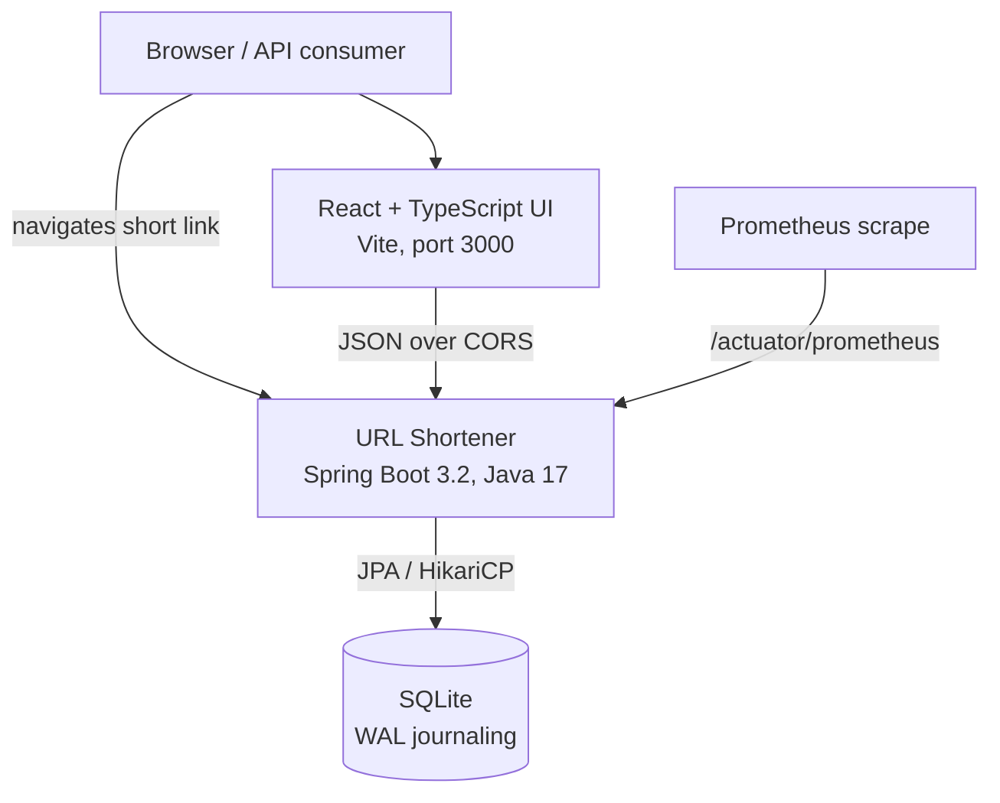
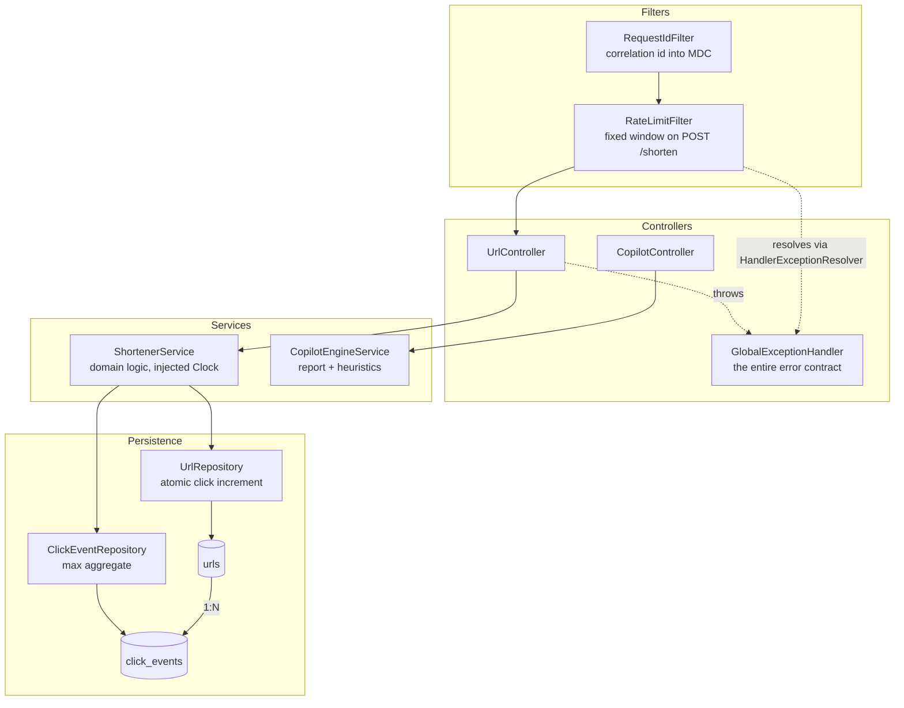
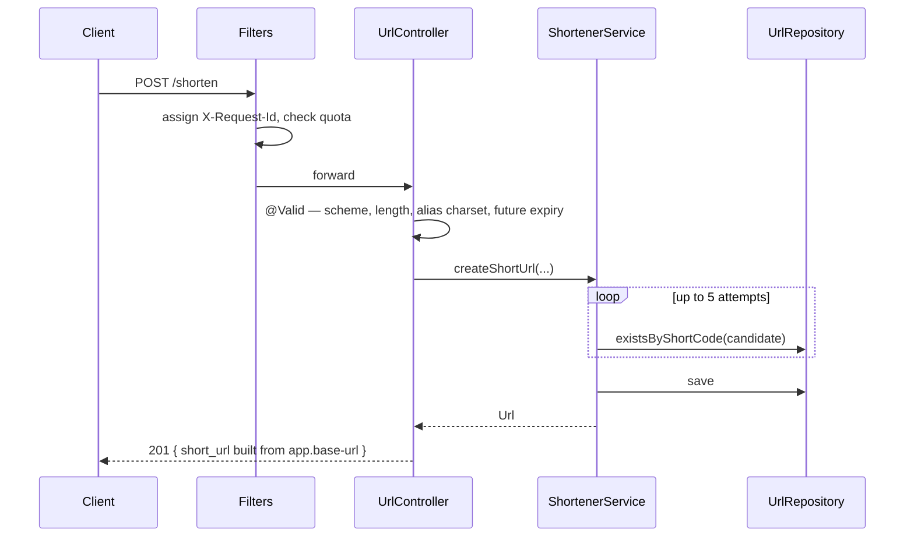
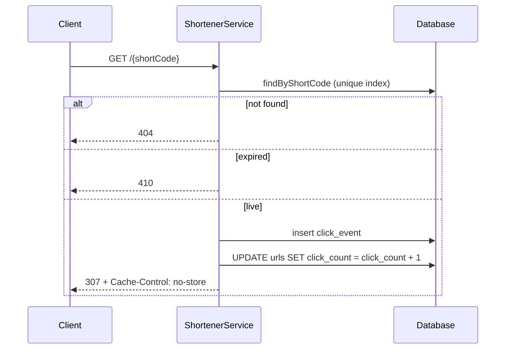

# Architecture

## System context



## Components



`RateLimitFilter` reaches `GlobalExceptionHandler` through
`HandlerExceptionResolver` rather than by throwing. A filter runs outside the
`DispatcherServlet`, so a thrown exception would bypass `@RestControllerAdvice`
entirely and produce the container's default error page — breaking the error
contract for exactly one status code. This was a real bug, caught by a test that
asserted the 429 body shape.

## Layering

| Layer | Owns | Must not know about |
| --- | --- | --- |
| Filters | Correlation, quotas | Domain concepts |
| Controllers | HTTP, validation, status codes | Persistence |
| Services | Domain logic, transactions | HTTP, `LocalDateTime.now()` |
| Repositories | Queries | HTTP, business rules |

`ShortenerService` takes a `Clock` instead of calling `now()` statically. That
one constraint is why expiry boundaries are asserted exactly rather than with
sleeps.

## Request flows

### Create



The existence check is an early rejection, not the uniqueness guarantee — two
concurrent requests can both pass it. The unique index decides, and the loser's
`DataIntegrityViolationException` becomes a 409.

### Redirect



The increment is SQL, not application state. Read-modify-write through the
entity lost 80% of increments at 100 concurrent requests.

## Data model

```
urls
  id            PK
  original_url  TEXT     NOT NULL
  short_code    VARCHAR(16) NOT NULL UNIQUE, INDEXED
  click_count   INTEGER  NOT NULL DEFAULT 0
  created_at    DATETIME NOT NULL
  expires_at    DATETIME NULL          -- NULL = never expires

click_events
  id            PK
  url_id        FK -> urls.id
  clicked_at    DATETIME NOT NULL
```

`click_count` is denormalised deliberately: the redirect path must not
`COUNT(*)` a growing table. `click_events` exists so time-series analytics are a
query rather than a migration plus a backfill of data that was never captured.

## Key decisions

| Decision | Rationale | Cost accepted |
| --- | --- | --- |
| 307, not 301 | A cached permanent redirect freezes the destination and silently stops click counting | An extra round trip per click |
| Random base62, not a counter | Sequential codes are enumerable — anyone can walk the keyspace and read every link | A uniqueness check and a retry budget |
| Atomic SQL increment | Read-modify-write loses concurrent updates | Entity state is stale after the call, so the method returns the destination instead |
| Pool size 1 | SQLite has one writer; a larger pool converts waiting into `SQLITE_BUSY` failures | Write throughput ceiling — removed by moving to PostgreSQL |
| WAL journaling | Readers stop blocking the writer, and every redirect is a write | A second file on disk |
| Base URL from config | `Host` is client-controlled; deriving links from it is injection | One more thing to configure per environment |
| `error_id` instead of the cause | Exception text leaked SQL and framework internals | A support flow that requires log access |
| Report in a JSON resource | Documentation edits stop being code changes, and claims can be test-verified | Loading and parsing at startup |

## Scaling path

Ordered by what binds first:

1. **PostgreSQL** — removes the single-writer ceiling. Connection string plus
   deleting the pool pin; no application code changes.
2. **Cache on redirect** — read-through on hot codes, invalidated on expiry.
3. **Async click recording** — batched writes; trades exact counts for
   throughput, a semantic change that needs sign-off.
4. **Shared rate-limit state** — Redis or gateway-enforced; the in-memory
   limiter does not survive replication.
5. **Read replicas** — analytics served off a replica, redirects off the primary.

Steps 1 and 4 are prerequisites for running more than one instance at all.
