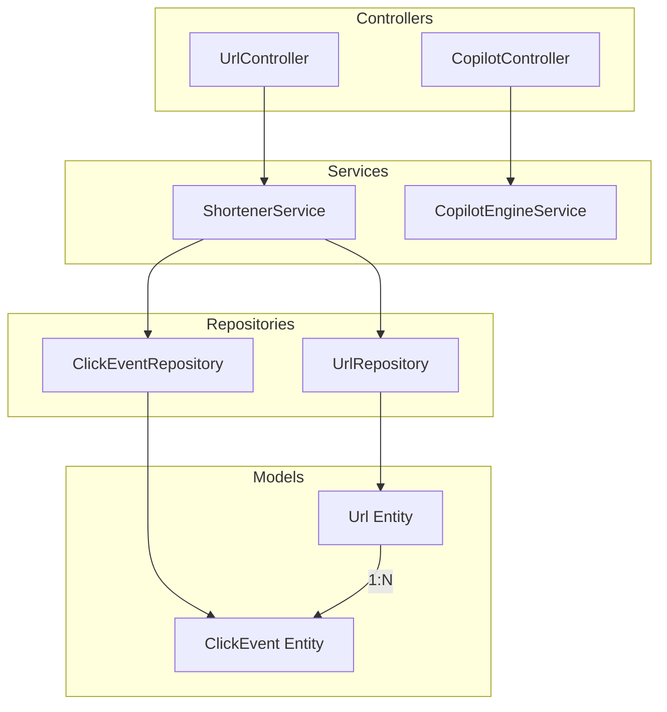

# Architecture Overview

## System Context

The URL Shortener is a Spring Boot application designed to receive long URLs and generate compact, unique short codes. It persists these mappings and provides a redirect mechanism while tracking click analytics.

```mermaid
graph TD
    Client[Client Browser / API Consumer]
    App[URL Shortener Service\nSpring Boot]
    DB[(SQLite Database)]
    
    Client -->|POST /shorten| App
    Client -->|GET /{shortCode}| App
    Client -->|GET /analytics/{shortCode}| App
    Client -->|POST /copilot/analyze| App
    App -->|JDBC / JPA| DB
```

## Component Diagram

The application is structured using a standard layered architecture.



## Execution Flows

### Shortening a URL
1. Client calls `POST /shorten` with a JSON payload containing `original_url`.
2. `UrlController` validates the payload.
3. `ShortenerService` generates a short code or validates a custom alias.
   - If using auto-generation, it retries up to 5 times if collisions occur.
4. The service saves a new `Url` entity to the database via `UrlRepository`.
5. The controller returns a 201 Created response with the shortened URL.

### Redirecting
1. Client visits `http://domain/{shortCode}`.
2. `UrlController` intercepts the path variable and calls `ShortenerService.resolveAndRecordClick()`.
3. If the code is not found, or if it is expired, an exception is thrown and mapped to a 404/410 by `GlobalExceptionHandler`.
4. If found and valid, the click count is incremented, and a `ClickEvent` is recorded.
5. The controller returns a 307 Temporary Redirect response to the original URL.
