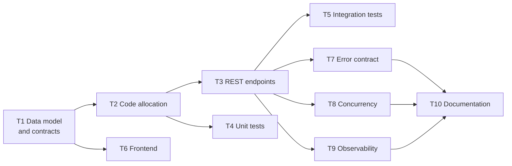

# Scenario 1 — Greenfield: build the URL shortener

**Type:** new system from nothing
**Requirement as given:** *"Build a URL shortener service from scratch with core APIs, analytics, and reliability features."*

---

## 1. Requirement interpretation

The requirement names three things and defines none of them. Before writing code
I turned each into something that could be accepted or rejected:

| As stated | As engineered | Why this reading |
| --- | --- | --- |
| "core APIs" | `POST /shorten`, `GET /{shortCode}`, `GET /analytics/{shortCode}` | The minimum closed loop: create, use, measure. Anything less is not usable; anything more is scope I chose, not scope I was given. |
| "analytics" | click count, created-at, last-clicked-at, expiry state | A counter alone answers no question about *when*. I stored per-click events so time-series questions are a query away, not a migration away. |
| "reliability features" | bounded retries, exact click accounting under concurrency, an error contract that separates client from server faults, health endpoint | The most defensible reading: things that keep the service correct when it is under stress or being used wrongly. |

**What I did not build, deliberately:** authentication, link deletion, custom
domains, QR codes, a caching layer. Each is defensible scope creep; none was
asked for. They are recorded in [LIMITATIONS.md](../LIMITATIONS.md) rather than
half-built.

## 2. Decomposition

Sequenced by dependency, not by preference. Data model first because every
later choice is downstream of it.

The full table, including what AI contributed to each task, is in
[AI_TRACEABILITY.md](../AI_TRACEABILITY.md) and is served by
`POST /copilot/analyze`.

## 3. Decisions worth defending

**7-character base62, randomly generated.** ~3.5x10¹² codes. The alternative —
a counter encoded to base62 — gives shorter codes and guaranteed uniqueness with
no retry, but makes codes sequential and therefore enumerable: anyone can walk
the keyspace and read every link in the system. Random codes cost a uniqueness
check; enumerable codes cost confidentiality. I took the check.

**307, not 301.** A permanent redirect is cached by browsers and
intermediaries. Two consequences: the destination can never be repointed, and
click counts silently stop incrementing once caches warm — the analytics
requirement would quietly stop working. `Cache-Control: no-store` is set for
the same reason.

**A separate `click_events` table.** A single counter column is smaller and
faster. It also makes "clicks per day" impossible without a schema change and a
backfill of data that was never recorded. The event row is cheap now; the
missing history is not recoverable later.

**`SecureRandom`, not `Random`.** A short code is the only thing protecting an
unlisted link. `Random` is seeded predictably, so codes become guessable in
bulk.

**Domain logic free of HTTP and static time.** `ShortenerService` takes a
`Clock`, so both expiry boundaries are asserted deterministically rather than
with sleeps. That single decision is why the expiry tests are exact instead of
flaky.

## 4. Validation

| Claim | How it is proven |
| --- | --- |
| Codes are unique and generation is bounded | Unit test asserts exactly 5 attempts before failing (pins the bound itself, not just the failure) |
| Concurrent clicks are counted exactly | `RedirectConcurrencyIntegrationTest`: 100 parallel redirects, all 307, count exactly 100 |
| Alias races produce one winner | 20 parallel claims: exactly 1 created, 19 conflicts, zero 500s |
| Expiry boundary is correct | Two unit tests: expiry equal to now is live, one nanosecond earlier is expired |
| No error leaks internals | `ErrorContractIntegrationTest` scans bodies against a forbidden-fragment list |
| Coverage is real | JaCoCo gate fails the build below 80% branch on `ShortenerService` (currently 100%) |

## 5. Honest assessment

Greenfield work produces a running service quickly, and the parts that can be
reasoned about statically — layering, validation, error types — hold up well
under that speed. The parts that cannot do **not**: the concurrency and
error-disclosure defects were both invisible to code review and to a green test
suite, and surfaced only under adversarial probing of the running service.

That asymmetry is the transferable lesson. Building fast is safe for structure
and unsafe for behaviour under load and under attack, so those two need a
different kind of evidence — which is what the brownfield scenario covers.
